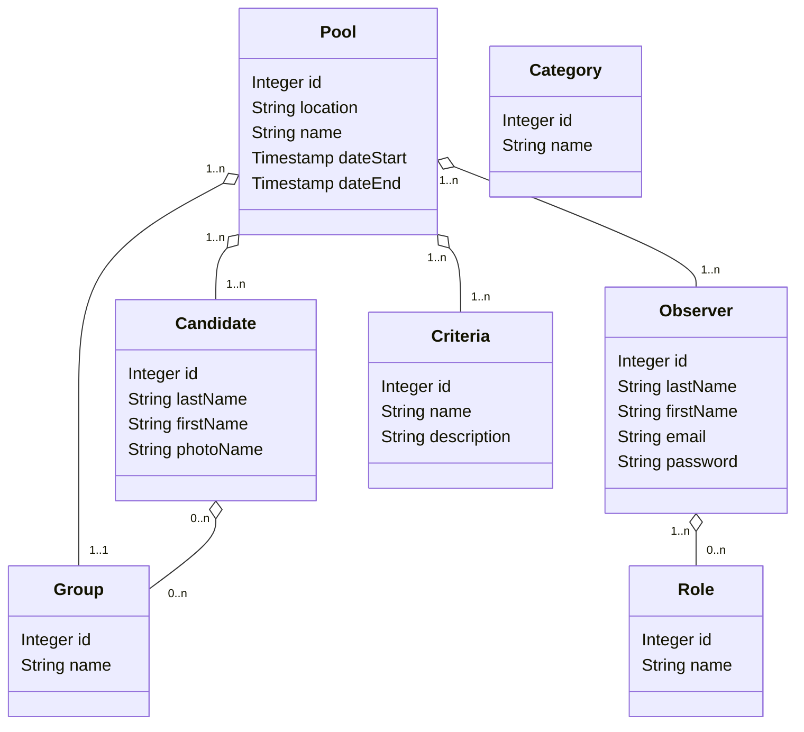

```mermaid
classDiagram
    class Pool 
    class Candidate
    class Observer
    class Criteria
    class Group
    class Category
    class Role

    Pool "1..n" o-- "1..1" Group
    Pool "1..n" o-- "1..n" Criteria
    Pool "1..n" o-- "1..n" Candidate
    Pool "1..n" o-- "1..n" Observer
    Observer "1..n" o-- "0..n" Role
    Candidate "0..n" o-- "0..n" Group

    Pool: Integer id
    Pool: String location
    Pool: String name
    Pool: Timestamp dateStart
    Pool: Timestamp dateEnd

    Observer: Integer id
    Observer: String lastName
    Observer: String firstName
    Observer: String email
    Observer: String password
    
    Category: Integer id
    Category: String name

    Candidate: Integer id
    Candidate: String lastName
    Candidate: String firstName
    Candidate: String photoName
    
    Role: Integer id
    Role: String name
    
    Group: Integer id
    Group: String name

    Criteria: Integer id
    Criteria: String name
    Criteria: String description
```