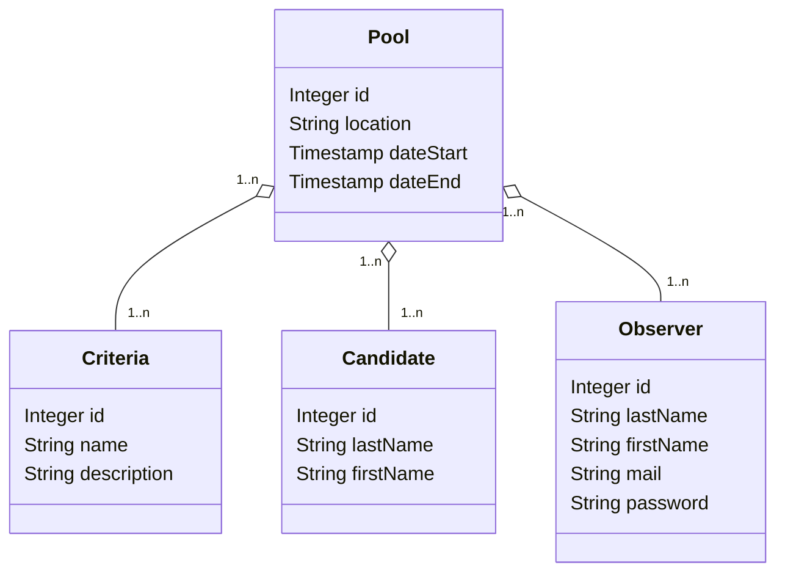

```mermaid
classDiagram
    class Pool 
    class Candidate
    class Observer
    class Criteria

    Pool "1..n" o-- "1..n" Criteria
    Pool "1..n" o-- "1..n" Candidate
    Pool "1..n" o-- "1..n" Observer

    Pool: Integer id
    Pool: String location
    Pool: Timestamp dateStart
    Pool: Timestamp dateEnd
    
    Criteria: Integer id
    Criteria: String name
    Criteria: String description
    
    Candidate: Integer id
    Candidate: String lastName
    Candidate: String firstName

    Observer: Integer id
    Observer: String lastName
    Observer: String firstName 
    Observer: String mail
    Observer: String password
```