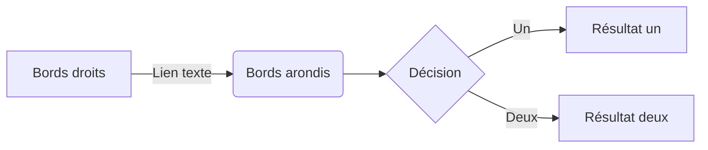
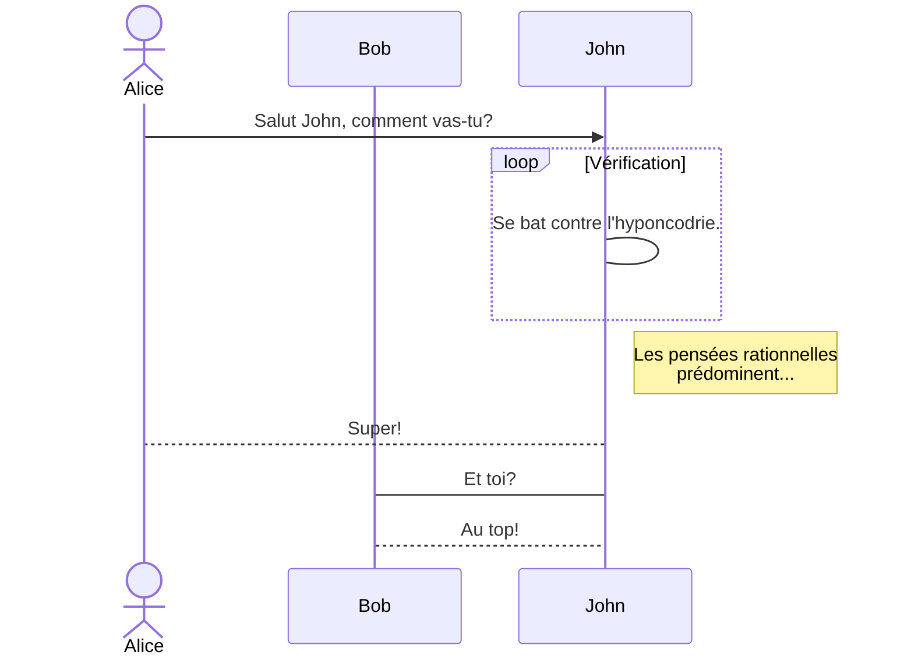
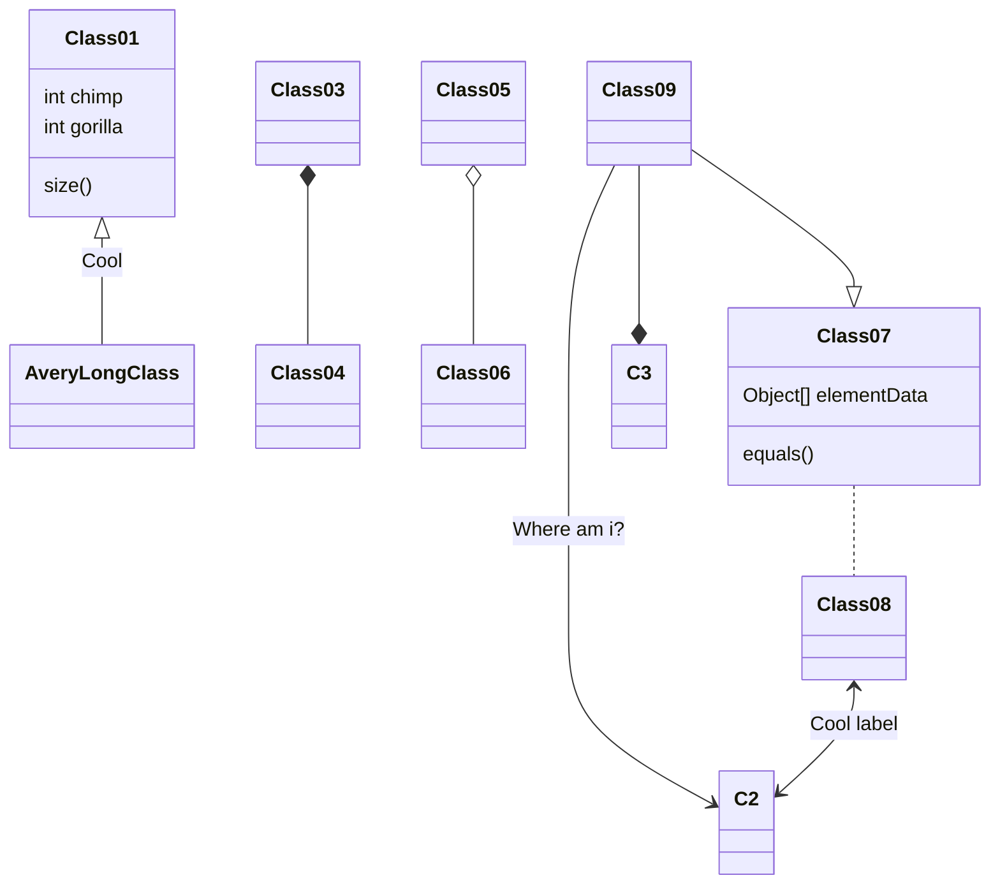
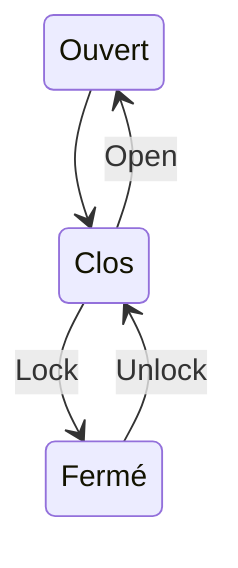

```mermaid
graph LR
    A[Bords droits] -->|Lien texte| B(Bords arondis)
    B --> C{Décision}
    C -->|Un| D[Résultat un]
    C -->|Deux| E[Résultat deux]
```

```mermaid
sequenceDiagram
    actor Alice
    participant Bob
    Alice->>John: Salut John, comment vas-tu?
    loop Vérification
        John->John: Se bat contre l'hyponcodrie.
    end
    Note right of John: Les pensées rationnelles<br/>prédominent...
    John-->Alice: Super!
    John->Bob: Et toi?
    Bob-->John: Au top!
```

```mermaid
classDiagram
      Class01 <|-- AveryLongClass : Cool
      Class03 *-- Class04
      Class05 o-- Class06
      Class07 .. Class08
      Class09 --> C2 : Where am i?
      Class09 --* C3
      Class09 --|> Class07
      Class07 : equals()
      Class07 : Object[] elementData
      Class01 : size()
      Class01 : int chimp
      Class01 : int gorilla
      Class08 <--> C2: Cool label
```

```mermaid
stateDiagram-v2
    ouvert: Ouvert
    clos: Clos
    fermé: Fermé
    ouvert --> clos
    clos   --> fermé: Lock
    fermé --> clos: Unlock
    clos --> ouvert: Open
```